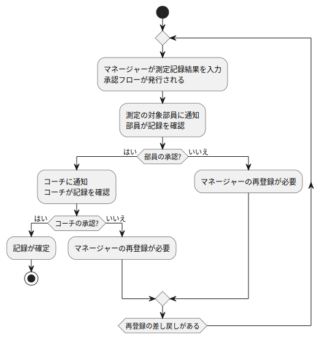
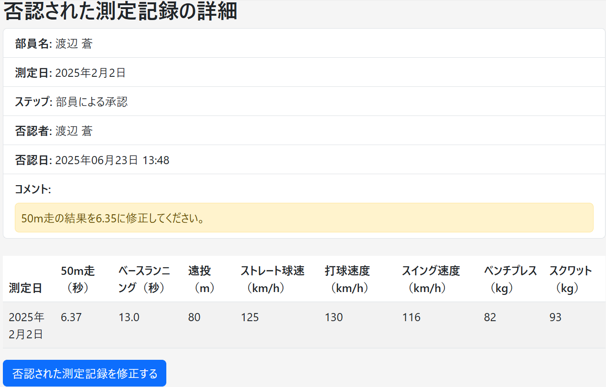
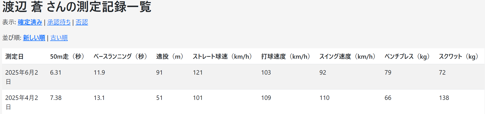
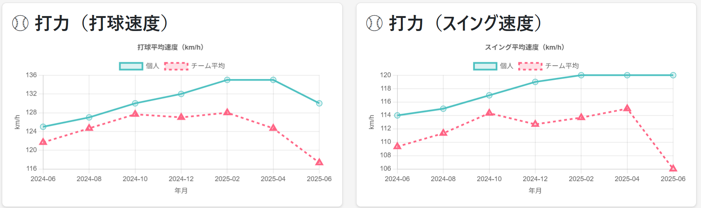

# 課題プレゼンテーション

**ABC 高校野球部 タレントマネジメントシステム**
**_〜部員の成長を「記録とデータ」で支えるアプリ〜_**

塩崎友貴
2025 年 6 月

---

# アプリ概要 – ABC 高校野球部 タレントマネジメント

## ✅ 制作したアプリの内容

- 高校野球部向けのタレントマネジメントアプリ
- 課題 1： 必須機能の実装
- 課題 2： チーム全体・各部員の傾向を**時系列グラフ**で表示する機能を実装

## 🎯 アプリの目的・目標

- 部員一人一人のスキルを**時系列的に記録・把握**
- チームの実力推移を**データで視覚的に分析・可視化**
- 部員・マネージャー・コーチ・監督**全員が使いやすい設計**を目指しました。

---

  

  <h1>課題1の工夫点 その1</h1>
  <ul>
  <li>測定記録の承認において、3段階の承認フロー（マネージャー → 部員 → コーチ）を実装</li>
  <li>否認された場合は、<strong>マネージャーに自動通知＋再登録フロー</strong>へ戻る設計</li>
  <li>各ステップに通知機能を、部員・コーチにはコメント入力欄を組み込むことで、<strong>アプリ内で承認フローを完結</strong>できる</li>
  </ul>
  

  

---

# 課題 1 の工夫点 その 1 - 否認コメントのやり取り

- 承認・否認する際、**部員・コーチはコメント入力**が可能。
- マネージャーはコメントを見ながら、記録を確認・修正・再登録できる。

  

    
⬅️ 部員の承認・否認画面

    
  

  

    
➡️ マネージャーが否認記録を確認

    
  

---

# 課題 1 の工夫点 その 2 - 測定記録の時系列表示

- 測定記録は測定日の順序で、表として一覧表示し
  - **新しい順／古い順**の並び替えリンクを設置
  - 記録は状態（確定済み・承認待ち・否認）で切り替え可能

---

# 課題 2 チームの分析機能 - 時系列グラフ

## 目的・実装内容

- **🎯 目的**：チーム傾向の可視化＆部員の強み・課題把握
- **✅ 実装内容**：

| ロール       | 機能                                     | 活用法                             |
| ------------ | ---------------------------------------- | ---------------------------------- |
| 部員         | 自身の記録とチーム平均の時系列グラフ閲覧 | 自分の成長把握と課題発見           |
| コーチ・監督 | 部員別記録とチーム平均の時系列グラフ閲覧 | チーム傾向の分析と個別指導の質向上 |

---

# 📊 時系列グラフの種類と活用法（詳細）

| グラフの種類       | 特徴                             | 主な活用法                 | 主な利用者   |
| ------------------ | -------------------------------- | -------------------------- | ------------ |
| 自分の記録のみ     | シンプルで見やすい               | 自己成長の記録、推移確認   | 部員         |
| 自分 vs チーム平均 | 個人とチームの比較が可能         | 自分の立ち位置や課題の把握 | 部員         |
| チーム平均のみ     | 全体傾向がひと目でわかる         | チーム戦略・全体方針の確認 | コーチ・監督 |
| 部員 vs チーム平均 | 個人分析とチーム比較の両立が可能 | 指導・育成判断に役立つ     | コーチ・監督 |

---

# 活用イメージ：時系列グラフ - 個人 vs チーム平均

| ロール          | 活用目的                                 |
| --------------- | ---------------------------------------- |
| 🧍‍♂️ 部員         | 自身の成長を振り返り、強み・課題を確認   |
| 🧑‍🏫 コーチ・監督 | 部員個別の分析・チーム内比較で指導材料に |

---

# 課題・インターンの感想

- **課題 1・2**：課題に沿ったアプリを作れるか不安もありましたが、必要な要件を満たすものが完成し、達成感を感じています。
- **課題 3**：情報リテラシーに関するレポートは、内容がしっかりしていて考えさせられるものでした。楽しみながら取り組めました。
- **今後の展望**：
  - 課題 2 では、部員育成のためのツールとして時系列グラフを実装できました。野球部員のタレントマネジメントを行うという、一番の目的は達成できたと思います。
  - 今後はユーザーからのフィードバックを受けて機能の改善や追加、さらにヒアリングで得た要望（例：メッセージ記録機能）の実装を目指したいです。
