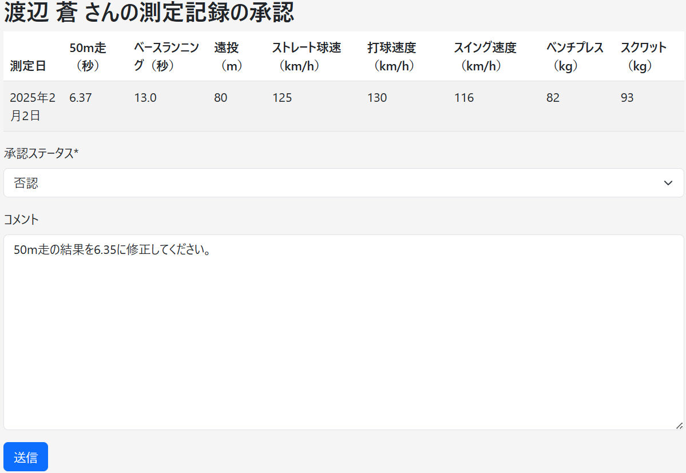

# 課題プレゼンテーション  
**神奈川県立JPT高校野球部 タレントマネジメントシステム**
***〜部員の成長を「記録とデータ」で支えるアプリ〜***

塩崎友貴
2025年6月

---

# アプリ概要 – JPT高校野球部 タレントマネジメント

## ✅制作したアプリの内容
  - 高校野球部向けのタレントマネジメントアプリ
  - 課題1： 必須機能の実装
  - 課題2： チーム全体の傾向を**時系列グラフ**で表示する機能を実装
## 🎯アプリの目的・目標
  - 部員一人一人のスキルを**時系列的に記録・把握**
  - チームの実力推移を**データで視覚的に分析**
  - 部員・マネージャー・コーチ・監督**全員が使いやすい設計**を目指しました。

---

  

  <h1>課題1の工夫点 その1</h1>
  <ul>
  <li>測定記録の承認において、3段階の承認フロー（マネージャー → 部員 → コーチ）を実装</li>
  <li>否認された場合は、<strong>マネージャーに自動通知＋再登録フロー</strong>へ戻る設計</li>
  <li>各ステップに通知機能を、部員・コーチにはコメント入力欄を組み込むことで、<strong>アプリ内で承認フローを完結</strong>できる</li>
  </ul>
  

  

---

# 課題1の工夫点 その1 - 否認コメントのやり取り

- 承認・否認する際、**部員・コーチはコメント入力**が可能。
- マネージャーはコメントを見ながら、記録を確認・修正・再登録できる。

  

    
⬅️ 部員の承認・否認画面

    
  

  

    
➡️ マネージャーが否認記録を確認

    
  

---

# 課題1の工夫点 その2 - 測定記録の時系列表示
- 測定記録は測定日の順序で、表として一覧表示し
  - **新しい順／古い順**の並び替えリンクを設置
  - 記録は状態（確定済み・承認待ち・否認）で切り替え可能

---

# 課題2 チームの分析機能
## 目的と実装内容
- 目的：チーム全体の傾向を可視化・確認できること
- 実装：各測定項目についての、チーム全体の平均値の時系列グラフ

---

# 課題・インターンの感想
- 課題1・2：課題に沿ったアプリを作れるか不安もありましたが、必要な要件を満たすものが作れたと思うので、うれしく思っています。
- 課題3：情報リテラシーに関するレポートは、内容がしっかりしていて考えさせられるものでした。楽しみながら取り組めました。
- 今後やりたいこと：課題2でさらに実装したい機能はいろいろあり（特に各部員の育成のためのツールの実装（チーム平均との比較など））、余裕があればさらに機能を追加したいです。
